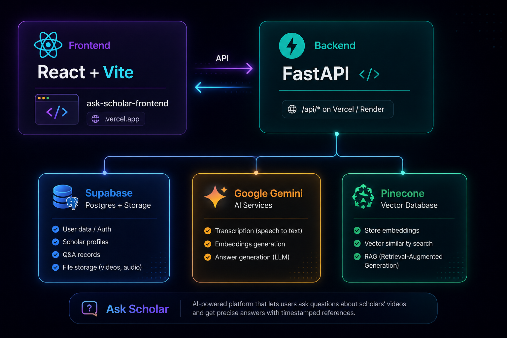

<div align="center">

# 🕌 Ask Scholar

**Ask a verified religious scholar — get answers grounded in their own videos and writings.**

### 🔗 [**Live App → ask-scholars.vercel.app/**](https://ask-scholars.vercel.app/)

[](https://ask-scholar-frontend.vercel.app/)
[](#-frontend)
[](#-backend)
[](https://supabase.com/)
[](#-rag-pipeline)
[](#-license)

</div>

---

## 📖 About

**Ask Scholar** is a full-stack platform that connects users with verified
religious scholars. Users browse scholar profiles, ask questions, and — thanks
to an integrated **RAG (Retrieval-Augmented Generation)** pipeline — get
pointed to the *exact timestamp in the scholar's own video* where a related
answer already exists, instead of a generic AI-generated response.

> 🚫 **No AI-generated rulings.** The app deliberately never lets an LLM
> author a religious answer on a scholar's behalf — the AI only retrieves
> and points to what the scholar themselves has already said. do not belive untill
> you checked the citations and complete video to know whole context.

**🌐 Try it live:** **[ask-scholar-frontend.vercel.app](https://ask-scholar-frontend.vercel.app/)**

---

## ✨ Features

- 👳 **Browse verified scholars** — filter by fiqah, specialization, languages, experience
- 💬 **Ask a scholar a question** — get routed to the most relevant video + timestamp via RAG search
- 🔑 **User & Admin authentication** — JWT-based, separate roles for regular users and platform admins
- 🛠️ **Admin dashboard** — create/invite/suspend scholars, manage users, link YouTube videos
- 🎥 **Automatic video ingestion** — linking a video to a scholar transcribes it and embeds it into a searchable knowledge base in the background
- 📄 **Document ingestion** — reference documents (PDF/DOCX/URL) can be ingested and searched the same way
- 🖼️ **Scholar profile pictures** via Supabase Storage
- 📱 **Responsive UI** — works across desktop and mobile

---

## 🏗️ Architecture

<p align="center">
  
</p>

The **frontend** is a standalone React/Vite app deployed on Vercel and talks
to the **backend** purely over its REST API (`VITE_API_BASE_URL`). The
**backend** is a single FastAPI service that owns auth, the scholar
directory/admin panel, and the RAG ingestion + search pipeline — all backed
by Supabase Postgres, Gemini, and Pinecone.

---

## 🖥️ Frontend

Live at **[ask-scholar-frontend.vercel.app](https://ask-scholar-frontend.vercel.app/)**, deployed on Vercel.

It's a React + Vite single-page app that talks to the backend exclusively
through `VITE_API_BASE_URL` (no direct database/Supabase access from the
client) — pages for browsing scholars, the ask-a-question chat panel, user
auth, and an admin dashboard for managing scholars/videos/users.

> This repo/README covers the **backend** in setup detail. If you're working
> on the frontend, point it at your own backend instance by setting:
> ```env
> VITE_API_BASE_URL=http://localhost:5000/api
> ```
> and make sure the backend's `FRONTEND_ORIGIN` matches your frontend's URL for CORS.

---

## ⚙️ Backend

A single FastAPI service combining two pieces into one codebase/process:

| Piece | What it does |
|---|---|
| 🔐 **Core API** | Auth (users + admins), scholar directory, admin CRUD, `askQuestion` chat endpoint — backed by **Supabase Postgres** via async SQLAlchemy |
| 🧠 **RAG Engine** | YouTube / document ingestion → Gemini transcription & embeddings → **Pinecone** similarity search, mounted at `/api/rag/*` and wired directly into the scholar Q&A flow |

RAG is fully optional — the API boots and runs fine without any Gemini /
Pinecone keys, it just no-ops those features.

### Tech Stack

| Layer | Technology |
|---|---|
| Framework | [FastAPI](https://fastapi.tiangolo.com/) + [Uvicorn](https://www.uvicorn.org/) |
| Database | [Supabase](https://supabase.com/) (PostgreSQL) via async [SQLAlchemy 2.0](https://www.sqlalchemy.org/) + `asyncpg` |
| Auth | `PyJWT` + `passlib[bcrypt]` |
| Validation | `Pydantic v2` / `pydantic-settings` |
| File Storage | Supabase Storage (scholar profile pictures) |
| LLM / Embeddings | Google **Gemini** (`google-genai`) |
| Vector DB | **Pinecone** |
| Video/Doc ingestion | `yt-dlp`, `pdfplumber`, `python-docx` |

### Project Structure

```
app/
├── main.py                FastAPI app, CORS, error envelope, startup (create tables + seed admin)
├── config.py               Core settings loaded from .env (pydantic-settings)
├── database.py              Async SQLAlchemy engine/session (asyncpg, Supabase-pooler friendly)
├── models.py                 Admin, User, Scholar, Video (SQLAlchemy ORM)
├── schemas.py                Pydantic request/response models (camelCase, matches frontend)
├── serializers.py             ORM → Pydantic conversion helpers
├── security.py                 bcrypt hashing + JWT create/decode
├── deps.py                      get_current_user / get_current_admin auth dependencies
├── storage.py                    Uploads scholar pictures to Supabase Storage
├── seed.py                        Auto-seeds the admin account on startup
│
├── routers/
│   ├── auth.py             POST /auth/user/register, /auth/user/login, /auth/admin/login
│   ├── scholars.py          GET /scholars, GET /scholars/{id}, POST /scholars/askQuestion/{id}
│   └── admin.py               Scholar CRUD/invite, video linking, user management (admin-only)
│
└── rag/                     RAG subsystem
    ├── config.py               Env vars, Gemini model fallback chains, chunking/Pinecone settings
    ├── gemini_manager.py        GeminiKeyManager — key pool + per-task model fallback
    ├── schemas.py                 Pydantic models for /api/rag/*
    ├── router.py                   POST /rag/ingest/youtube, /ingest/document/*, /search
    └── services/
        ├── youtube_service.py       Download audio → Gemini transcript → cleanup
        ├── docs_service.py           Fetch/extract document text → cleanup
        ├── chunking.py                 Plain-text + timestamped-transcript chunking
        ├── embedding_service.py         Gemini embeddings + Pinecone upsert/query
        ├── answer_service.py             Builds the grounded askQuestion answer
        ├── ingest_state.py                 Checkpointing for resumable ingestion
        └── translation.py                   Answer translation
```

---

## 🚀 Running the Backend Locally

### Prerequisites

- **Python 3.11+**
- A **Supabase** project (free tier is fine)
- `ffmpeg` installed system-wide *(only needed if you enable RAG video ingestion)*
- **Gemini API key(s)** and a **Pinecone** account *(only needed for RAG)*

### 1️⃣ Set up a virtual environment

```bash
cd backend
python3 -m venv .venv
source .venv/bin/activate      # Windows: .venv\Scripts\activate

pip install -r requirements.txt
```

### 2️⃣ Create your Supabase project

1. Go to [supabase.com](https://supabase.com) → **New project**.
2. **Database connection string** → Project Settings → Database → *Connection string* → **URI**.
   Use the **Transaction pooler** (port `6543`) string. Copy it into `DATABASE_URL`, then:
   - change the scheme from `postgresql://` → `postgresql+asyncpg://`
   - fill in your real database password
3. **Storage** (for scholar profile pictures) → Storage → *New bucket* → name it e.g. `scholar-pictures` → toggle **Public**.
   Then copy the **Project URL** and **service_role key** into `SUPABASE_URL` / `SUPABASE_SERVICE_KEY`.

> Skip picture uploads for now? Leave the Supabase Storage vars unset — everything else still works.

### 3️⃣ Configure environment variables

```bash
cp .env.example .env
```

<details>
<summary><strong>📋 .env.example (click to expand)</strong></summary>

```env
# --- Supabase / Database ---
DATABASE_URL="postgresql+asyncpg://<user>:<password>@<host>:6543/postgres"
SUPABASE_URL=https://<your-project-ref>.supabase.co
SUPABASE_SERVICE_KEY=<your-supabase-service-role-key>
SUPABASE_STORAGE_BUCKET=scholar-pictures

# --- Auth ---
JWT_SECRET="change-this-to-a-long-random-string"
JWT_ALGORITHM=HS256
JWT_EXPIRES_MINUTES=10080

# --- CORS ---
FRONTEND_ORIGIN=http://localhost:5173

# --- Server ---
PORT=5000

# --- Auto-seeded admin account ---
ADMIN_NAME="Admin"
ADMIN_EMAIL="admin@example.com"
ADMIN_PASSWORD="change-this-password"

# --- RAG: Gemini (optional — up to 3 keys for rotation) ---
GEMINI_API_KEY_1=
GEMINI_API_KEY_2=
GEMINI_API_KEY_3=

# --- RAG: Pinecone (optional) ---
PINECONE_API_KEY=
PINECONE_INDEX_NAME=knowledge-base
PINECONE_CLOUD=aws
PINECONE_REGION=us-east-1
EMBEDDING_DIMENSION=768

# --- RAG: retry / backoff tuning (optional) ---
MAX_RETRIES_PER_KEY_ROUND=6
RATE_LIMIT_SLEEP_SECS=15
RATE_LIMIT_BACKOFF=1.6

# --- RAG: chunking (optional) ---
CHUNK_SIZE_CHARS=1200
CHUNK_OVERLAP_CHARS=150
```

</details>

> 🔒 **Never commit your real `.env`.** Keep only `.env.example` (with placeholder values) in version control.

### 4️⃣ (Optional) Enable RAG

```bash
# Debian/Ubuntu
sudo apt-get install -y ffmpeg

# macOS
brew install ffmpeg
```

Then fill in `GEMINI_API_KEY_1/2/3` and `PINECONE_API_KEY` / `PINECONE_INDEX_NAME` in `.env`.
The Pinecone index is **auto-created** on first use if it doesn't already exist.

### 5️⃣ Run the server

```bash
uvicorn app.main:app --host 0.0.0.0 --port 5000 --reload
```

On first startup the app will:
- ✅ create all database tables (`SQLAlchemy metadata.create_all`)
- ✅ auto-seed one admin account from `ADMIN_NAME` / `ADMIN_EMAIL` / `ADMIN_PASSWORD`

The API is served under `/api`, e.g. `http://localhost:5000/api/scholars`.

📘 Interactive docs (Swagger UI): **http://localhost:5000/docs**

### 6️⃣ Point the frontend at it

```env
VITE_API_BASE_URL=http://localhost:5000/api
```

And set the backend's `FRONTEND_ORIGIN` to your frontend's dev URL (e.g. `http://localhost:5173`) so CORS allows it. The live production frontend at
[ask-scholar-frontend.vercel.app](https://ask-scholar-frontend.vercel.app/) points at the deployed backend instance instead.

---

## 🗺️ Database Migrations

No Alembic setup yet — the schema is kept in sync automatically:

> On every startup, `SQLAlchemy.metadata.create_all()` runs and creates any
> tables from `app/models.py` that don't already exist in your Supabase
> database. It does **not** alter existing tables (won't drop columns,
> change types, etc.), so it's safe to leave running in dev.

**Going to production with schema changes down the line?** Swap this for real, versioned migrations:

```bash
pip install alembic
alembic init alembic
# point alembic.ini / env.py at app.database.Base + settings.database_url
alembic revision --autogenerate -m "describe your change"
alembic upgrade head
```

Until then, treat `app/models.py` as the single source of truth for the schema — the app creates it for you on boot, no manual SQL needed to get started.

---

## 📡 API Reference

Base path for everything below: `/api`

### 🔐 Auth — `/auth`

| Method | Endpoint | Description | Auth |
|---|---|---|---|
| `POST` | `/auth/user/register` | Register a new user | — |
| `POST` | `/auth/user/login` | User login → JWT | — |
| `POST` | `/auth/admin/login` | Admin login → JWT | — |

### 👳 Scholars — `/scholars`

| Method | Endpoint | Description | Auth |
|---|---|---|---|
| `GET` | `/scholars` | List active/verified scholars (filters, pagination) | — |
| `GET` | `/scholars/{id}` | Get a single scholar's public profile | — |
| `POST` | `/scholars/askQuestion/{id}` | Ask a scholar a question — RAG-grounded video/timestamp match | User |

### 🛠️ Admin — `/admin` *(all routes require an admin JWT)*

| Method | Endpoint | Description |
|---|---|---|
| `POST` | `/admin/scholars` | Create a scholar |
| `POST` | `/admin/scholars/invite` | Invite a scholar (sends invite token) |
| `GET` | `/admin/scholars` | List all scholars (incl. pending/suspended) |
| `DELETE` | `/admin/scholars/{id}` | Delete a scholar |
| `PATCH` | `/admin/scholars/{id}/status` | Update scholar status (active/suspended/pending) |
| `POST` | `/admin/scholars/{id}/resend-invite` | Resend an invite |
| `POST` | `/admin/videos` | Link a YouTube video to a scholar (kicks off background transcription + embedding) |
| `POST` | `/admin/documents/upload` | Upload & ingest a reference document |
| `POST` | `/admin/documents/url` | Ingest a reference document from a URL |
| `GET` | `/admin/users` | List all users |
| `DELETE` | `/admin/users/{id}` | Delete a user |

### 🧠 RAG — `/rag`

| Method | Endpoint | Description | Auth |
|---|---|---|---|
| `GET` | `/rag/health` | RAG subsystem health check | — |
| `POST` | `/rag/ingest/youtube` | Ingest a standalone YouTube video into a namespace | Admin |
| `POST` | `/rag/ingest/document/url` | Ingest a document from a URL | Admin |
| `POST` | `/rag/ingest/document/upload` | Ingest an uploaded document | Admin |
| `POST` | `/rag/search` | Similarity search over an ingested namespace | Admin |

> All admin/RAG routes expect `Authorization: Bearer <token>` from `/api/auth/admin/login`.

### ❤️ Health

| Method | Endpoint | Description |
|---|---|---|
| `GET` | `/api/health` | Service liveness check |

---

## 🔗 How the pieces connect

- **Linking a video** (`POST /admin/videos`) kicks off a **background task**
  that transcribes the video and stores its embeddings in Pinecone,
  namespaced by `scholar_id`. This doesn't block the response — if it fails
  or RAG isn't configured, the video link itself is unaffected.
- **`askQuestion`** never auto-generates a religious ruling — a human
  scholar always reviews the real answer — but it does a RAG search scoped
  to that scholar's namespace, and if a relevant passage is found, points
  the asker to the specific timestamp in the specific video instead of a
  generic placeholder.
- **`/rag/*`** is also exposed directly, for ingesting standalone reference
  material not tied to a specific scholar (pass your own `namespace`).

---

## 🧠 Design Notes

- **JWT payload**: `{ sub: <id>, role: "USER" | "ADMIN" }`, sent as a single `Authorization: Bearer <token>` header. Passwords hashed with bcrypt.
- **Public vs admin visibility**: `GET /scholars` and `GET /scholars/{id}` only return `status=ACTIVE` + `isActive=true` scholars; `PENDING`/`SUSPENDED` ones remain visible via `GET /admin/scholars`.
- **Scholar self-registration via invite token**: schema fields (`inviteToken` / `inviteTokenExpiry`) already exist — `POST /scholars/complete-invite` is the natural next endpoint if a "redeem invite" frontend page gets added.
- **RAG async work**: ingestion can take a while (long videos/docs) — for real production traffic, swap `BackgroundTasks` for a proper task queue (Celery / RQ).
- **Gemini model fallback**: model names/availability shift over time — check [ai.google.dev/gemini-api/docs/deprecations](https://ai.google.dev/gemini-api/docs/deprecations) if ingestion suddenly starts failing.

---

## 📄 License

MIT — do whatever you want with it, just don't blame me if a fatwa engine hallucinates. 😄
